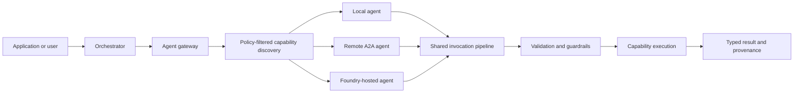

# Conducto

Conducto is a capability-first framework for building governed multi-agent systems in ordinary
Python and, after the Python contracts stabilize, .NET.

The project is designed around a simple goal: define an agent capability once, then discover and
invoke it through the same typed contract whether the target runs in the current process, behind an
A2A endpoint, in a container, or in Microsoft Foundry. Deployment should change configuration and
transport—not agent business logic.

## Why Conducto?

Agent systems often couple model prompts, tool definitions, service discovery, networking, and
authorization into one runtime. That makes agent-to-agent calls difficult to test, secure, and move
between environments.

Conducto separates those responsibilities:

- **Typed capabilities:** Python decorators reflect regular methods into validated capability
  schemas and deterministic Agent Cards.
- **Provider-neutral models:** Agents use opaque model references and structured-output contracts
  instead of importing vendor SDKs.
- **Governed execution:** Authorization, approvals, audit, deadlines, cancellation, and typed
  failures surround capability execution.
- **Capability-first discovery:** Callers ask for an allowed capability rather than hardcoding a
  particular deployment.
- **Transport-independent invocation:** Local and remote calls share validation, context,
  serialization, and result semantics.
- **Portable deployments:** The same agent contract is intended to progress from one process to
  containers, Microsoft Foundry, and optional cross-organization federation.
- **Cross-language conformance:** Python establishes the reference behavior; .NET follows shared
  schemas, protocol fixtures, and observable semantics.

## Current status

The repository currently ships the **Python reference SDK** in [`sdk-python/`](./sdk-python/).
Implemented foundations include:

- `@a2a_agent`, `@a2a_capability`, and `@tool` metadata
- deterministic Agent Card generation
- local agent registration and model-mediated routing
- validated capability invocation and typed result envelopes
- provider-neutral model configuration and per-run model isolation
- authorization scopes and approval challenges
- structured, correlation-safe runtime logging
- unit, golden-contract, acceptance, package, and installed-wheel tests

The local agent gateway, model-selected nested chaining, A2A 1.0 transport, provider adapters,
containers, Foundry integration, .NET parity, and federation are roadmap work. The README avoids
presenting those planned capabilities as already released.

## Intended execution model



The registry/catalog describes what agents exist. The gateway decides which eligible target and
transport to use. The runtime owns execution context, model resolution, security, auditing,
deadlines, cancellation, and results. Keeping these boundaries separate allows local behavior to
remain the reference for every later deployment.

## Python quick start

Requirements: Python 3.12 or newer and [`uv`](https://docs.astral.sh/uv/).

```bash
cd sdk-python
uv sync --locked --group dev
uv run python examples/quickstart.py
```

A minimal capability looks like:

```python
from conducto import BaseAgent, a2a_agent, a2a_capability


@a2a_agent(
    name="InventoryAgent",
    version="1.0.0",
    description="Answers inventory questions.",
)
class InventoryAgent(BaseAgent):
    @a2a_capability(description="Return the available quantity for one SKU.")
    def get_quantity(self, sku: str) -> dict[str, object]:
        return {"sku": sku, "quantity": 12}
```

See the [Python SDK guide](./sdk-python/README.md) for the complete two-agent example, public API,
package build, installed-wheel smoke test, and development commands.

## Architecture principles

1. **Python first, contracts first.** Python proves behavior before .NET ports it.
2. **Local before remote.** In-process execution establishes semantics before network transport.
3. **Capabilities before endpoints.** Agent code targets compatible capabilities, not deployment
   addresses.
4. **Policy before model exposure.** Unauthorized or incompatible tools never enter a model's
   toolbox.
5. **No authority amplification.** Delegation can preserve or reduce scopes, budgets, and
   deadlines, never expand them.
6. **Typed failures over hidden fallbacks.** Transport, policy, validation, approval, timeout, and
   execution failures remain distinguishable.
7. **Cloud-free required tests.** Stable CI requires no credentials, network services, or model
   downloads.

Read the [architecture guide](./docs/architecture.md), [security model](./docs/security-and-governance.md),
and [deployment topology guide](./docs/deployment-and-federation.md) for details.

## Roadmap

The active roadmap is tracked in [GitHub milestones](https://github.com/malcmiller/conducto-ai/milestones):

1. Python local agent flow
2. Python security and governance
3. Python agent chaining and local gateway
4. Python A2A network transport
5. Python exporters, observability, and packaging
6. Python model runtimes and Microsoft Foundry
7. Python hybrid deployment and workflow orchestration
8. .NET SDK parity and cross-language conformance
9. Cross-organization federation

The required product progression is **local Python → governed Python chaining → Python network
transport → operational packaging → containers and Foundry → hybrid workflows → .NET parity →
optional federation**.

## Repository layout

```text
.
├── AGENTS.md                    Repository-wide implementation rules
├── docs/                        Architecture, security, deployment, and development guides
├── sdk-python/                  Python reference SDK, tests, examples, and package metadata
└── .github/
    ├── instructions/            Path-specific Copilot instructions
    └── workflows/               Continuous-integration workflows
```

The .NET SDK will be added during the .NET parity milestone rather than maintained as an
unimplemented placeholder.

## Development

For Python development:

```bash
cd sdk-python
uv sync --locked --group dev
uv run ruff format .
uv run ruff format --check .
uv run ruff check .
uv run mypy src examples scripts tests/acceptance
uv run pytest
```

Changes to package behavior or public imports must also pass `uv build` and the installed-wheel
checks documented in [`sdk-python/README.md`](./sdk-python/README.md).

Repository-wide agent requirements are in [`AGENTS.md`](./AGENTS.md), with additional Python rules
in [`.github/instructions/sdk-python.instructions.md`](./.github/instructions/sdk-python.instructions.md).
The detailed contributor workflow is in [`docs/development-guide.md`](./docs/development-guide.md).

## Contributing

Choose an issue from the [roadmap](https://github.com/malcmiller/conducto-ai/issues), confirm its
dependencies are complete, and keep implementation aligned with its acceptance criteria. Pull
requests should include focused tests, updated public documentation, and a concise description of
the validation performed.

## License

Conducto is licensed under the [Apache License 2.0](./LICENSE).
