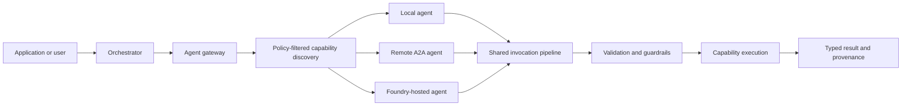

# Conducto

Conducto is a capability-first Python framework for building governed multi-agent systems.

The project is designed around a simple goal: define an agent capability once, then discover and
invoke it through the same typed contract whether the target runs in the current process, behind an
A2A endpoint, in a container, or in Microsoft Foundry. Deployment should change configuration and
transport—not agent business logic.

## Why Conducto?

Agent systems often couple model prompts, tool definitions, service discovery, networking, and
authorization into one runtime. That makes agent-to-agent calls difficult to test, secure, and move
between environments.

Conducto separates those responsibilities:

- **Typed capabilities:** Python decorators reflect regular methods into validated capability
  schemas and deterministic Agent Cards.
- **Provider-neutral models:** Agents use opaque model references and structured-output contracts
  instead of importing vendor SDKs.
- **Governed execution:** Authorization, approvals, audit, deadlines, cancellation, and typed
  failures surround capability execution.
- **Capability-first discovery:** Callers ask for an allowed capability rather than hardcoding a
  particular deployment.
- **Transport-independent invocation:** Local and remote calls share validation, context,
  serialization, and result semantics.
- **Portable deployments:** The same agent contract is intended to progress from one process to
  containers, Microsoft Foundry, and optional cross-organization federation.
- **Protocol conformance:** Checked-in schemas and fixtures pin observable wire behavior.

## What Conducto is for

Conducto is intended for systems where an application must coordinate specialized agents without
giving every model unrestricted access to every tool or deployment:

- an operations agent that delegates evidence gathering to documentation and diagnostic agents
- a business workflow that requires scoped authority and human approval before protected actions
- a local agent composition that later moves behind authenticated network boundaries
- a hybrid deployment that combines in-process, containerized, and Foundry-hosted agents
- independently deployed Python agents that must follow the same observable contract

Conducto is not intended to be another general-purpose chat UI or a vendor-specific model wrapper.
Its primary concern is the controlled discovery, delegation, and execution of typed agent
capabilities.

## Current status

The repository currently develops the **pre-v1 Python reference SDK** directly from the repository
root.
Implemented foundations include:

- `@a2a_agent`, `@a2a_capability`, and `@tool` metadata
- deterministic Agent Card generation
- local agent registration, policy-filtered discovery, and opaque capability bindings
- model-mediated routing and bounded model-selected delegation
- validated capability invocation and typed result envelopes
- provider-neutral model configuration and per-run model isolation
- authorization scopes and approval challenges
- structured, correlation-safe runtime logging
- pinned A2A 1.0 transport and governed remote-agent catalog contracts
- bounded Ollama and OpenAI-compatible provider adapters
- optional MCP export and OpenTelemetry integration

Container deployment, Foundry integration, durable workflow orchestration, and federation remain
roadmap work. No v1 API has shipped: common application entry points live in
`conducto`, specialized contracts in their owning `conducto.core` packages, and deterministic
test providers in `conducto.testing`.

## Intended execution model



The registry/catalog describes what agents exist. The gateway decides which eligible target and
transport to use. The runtime owns execution context, model resolution, security, auditing,
deadlines, cancellation, and results. Keeping these boundaries separate allows local behavior to
remain the reference for every later deployment.

## Python quick start

Requirements: Python 3.12 or newer and [`uv`](https://docs.astral.sh/uv/).

```bash
uv sync --locked --group dev
uv run python examples/quickstart.py
```

A minimal capability looks like:

```python
from conducto import BaseAgent, a2a_agent, a2a_capability


@a2a_agent(
    name="InventoryAgent",
    version="1.0.0",
    description="Answers inventory questions.",
)
class InventoryAgent(BaseAgent):
    @a2a_capability(description="Return the available quantity for one SKU.")
    def get_quantity(self, sku: str) -> dict[str, object]:
        return {"sku": sku, "quantity": 12}
```

For a complete installed-package verification:

```bash
uv run pytest -m acceptance
uv build
wheel=$(ls dist/*.whl)
uv run --no-project --with "$wheel" python examples/quickstart.py
uv run --no-project --with "$wheel" python scripts/smoke_test.py
```

Optional integrations are installed with package extras such as
`conducto-ai[registration]`, `conducto-ai[mcp]`, `conducto-ai[a2a-server]`,
`conducto-ai[ollama]`, `conducto-ai[openai]`, `conducto-ai[microsoft-foundry]`,
and `conducto-ai[opentelemetry]`.

## Architecture principles

1. **Python and contracts first.** Python establishes the reference behavior.
2. **Local before remote.** In-process execution establishes semantics before network transport.
3. **Capabilities before endpoints.** Agent code targets compatible capabilities, not deployment
   addresses.
4. **Policy before model exposure.** Unauthorized or incompatible tools never enter a model's
   toolbox.
5. **No authority amplification.** Delegation can preserve or reduce scopes, budgets, and
   deadlines, never expand them.
6. **Typed failures over hidden fallbacks.** Transport, policy, validation, approval, timeout, and
   execution failures remain distinguishable.
7. **Local reproducibility.** Core behavior must remain usable without cloud credentials, network
   services, or model downloads.

Read the [Python SDK architecture](./docs/architecture.md),
[security model](./docs/security-and-governance.md), and
[deployment topology guide](./docs/deployment-and-federation.md) for details.

## Roadmap

The active roadmap is tracked in [GitHub milestones](https://github.com/malcmiller/conducto-ai/milestones):

1. Python local agent flow
2. Python security and governance
3. Python agent chaining and local gateway
4. Python A2A network transport
5. Python exporters, observability, and packaging
6. Python model runtimes and Microsoft Foundry
7. Python hybrid deployment and workflow orchestration
8. Cross-organization federation

The required product progression is **local Python → governed Python chaining → Python network
transport → operational packaging → containers and Foundry → hybrid workflows → optional
federation**.

## Repository layout

```text
.
├── src/conducto/                Python package
├── tests/                       Unit, acceptance, and golden tests
├── examples/                    Runnable application examples
├── scripts/                     Release and installed-package verification
├── docs/                        Product and SDK documentation
├── pyproject.toml               Package and tool configuration
└── uv.lock                      Reproducible dependency lock
```

## Documentation

- [Start with Conducto in plain English](./docs/understanding/README.md)
- [Build with Conducto](./docs/using/README.md)
- [Understand the system design](./docs/system-design/README.md)
- [Maintain and extend Conducto](./docs/maintainers/README.md)
- [Complete documentation index](./docs/README.md)
- [Python SDK architecture](./docs/architecture.md)
- [Python SDK reference](./docs/sdk-reference.md)
- [Python security and governance](./docs/security-and-governance.md)
- [Communication and standards](./docs/communication-and-standards.md)
- [Deployment and federation](./docs/deployment-and-federation.md)
- [Repository automation and agent guidance](./docs/repository-automation.md)
- [Development guide](./docs/development-guide.md)
- [Release guide](./docs/releasing.md)

## Contributing

Choose an issue from the [roadmap](https://github.com/malcmiller/conducto-ai/issues), confirm its
dependencies are complete, and keep implementation aligned with its acceptance criteria. See the
[Python SDK development guide](./docs/development-guide.md) for setup and validation and
[repository automation documentation](./docs/repository-automation.md) for agent instructions and
workflows.

## License

Conducto is licensed under the [Apache License 2.0](./LICENSE).
