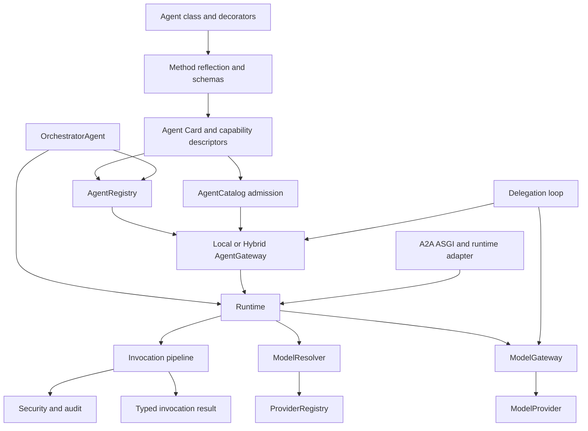
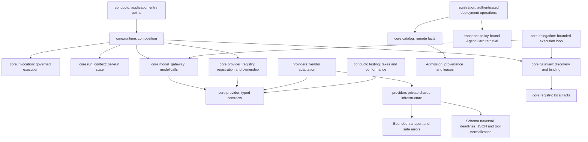

# Python SDK architecture

The Python SDK separates declaration, discovery, model access, and execution
so each concern can evolve without turning `Runtime` or `OrchestratorAgent`
into a monolith.

## Component map

## Python package boundaries

`conducto` is a small application facade, not an inventory of every SDK type.
`conducto.core` is a namespace. Domain packages publish their own contracts;
implementation helpers are not re-exported through unrelated facades.
`Runtime` composes collaborators rather than acting as an import hub.

Provider contracts separate message/content models, result/usage models,
typed errors, native tool channels, structured-schema validation, decision
parsing, capability validation, and retry/deadline handling. A provider
adapter consumes these same contracts; it does not create a second validation
or error path.

| Package                  | Implementation modules                                                                                                                          |
|--------------------------|-------------------------------------------------------------------------------------------------------------------------------------------------|
| `core.provider`          | `messages`, `configuration`, `results`, `errors`, `structured`, `tools`, `decisions`, `protocol`, `execution`                                   |
| `core.provider_registry` | `configuration`, `factories`, `registration`, `bindings`, `availability`, `ownership`, `lifecycle`, `cleanup`, `snapshots`, `state`, `registry` |
| Runtime composition      | `runtime` facade, `runtime_context` construction/attenuation, `runtime_invocation` authorization/approval wiring, `invocation` execution        |
| `core.gateway`           | `_contracts`, `_local`, `_hybrid`, `_discovery`, `_bindings`, `_schema`, `_projection`                                                          |
| `core.catalog`           | `_models`, `_providers`, `_admission`, `_lifecycle`                                                                                             |
| `core.delegation`        | `_models`, `_fallback`, `_results`, `_arguments`, `_loop`                                                                                       |
| `providers`              | Vendor-facing adapters over shared private `_config`, `_http`, `_lifecycle`, `_schema`, `_response`, `_tool_cache`                              |
| `conducto.testing`       | `fake_model` and provider conformance helpers, separate from production contracts                                                               |

The registry's implementation modules share one synchronization domain.
They are collaborators of `ProviderRegistry`, not alternative registries.
Use the package-level registry contracts for application imports; internal
state, leases, and mutation reservations remain implementation details.

First-party adapters own asynchronous HTTP pools through shared lifecycle
coordination. Cancelling a shutdown waiter does not abandon an in-progress
pool close; later shutdown calls await that same attempt. Cleanup failures
remain failures rather than turning an already-closed HTTPX state flag into
a successful result.

Provider registration separates factory allowlisting, immutable model
bindings, bounded availability evaluation, identity-based client ownership,
leases/retirement/cleanup, and credential-free snapshots. The registry lock
protects publication and lifecycle decisions; construction, health predicates,
and shutdown callbacks do not execute while holding it.

Gateway schema compatibility, local/remote selection, transport-neutral binding
issuance, and model-safe projection are distinct from binding authorization.
Catalog providers load candidate facts; admission validates Agent Cards and
provenance before lifecycle state becomes visible. Delegation models and result
mapping are separate from the execution loop; fallback is explicit policy, not
an exception-swallowing branch.

No wire contract changes are intended by these Python module moves. Golden
schemas and result envelopes remain the conformance boundary. Pre-v1 API
cleanup removes the generic `ProviderRegistry.register()`, runtime import
aliases, and agent-owned raw provider configuration. See the
[public import map](./sdk-reference.md) for preferred imports.

## Responsibility boundaries

| Component                  | Owns                                                                                                                                                | Does not own                                                           |
|----------------------------|-----------------------------------------------------------------------------------------------------------------------------------------------------|------------------------------------------------------------------------|
| `BaseAgent` and decorators | Agent metadata, capability declarations, agent defaults                                                                                             | Global registration, provider clients, transport                       |
| `registration.py`          | Reflection of decorated methods and registration metadata                                                                                           | Runtime agent discovery                                                |
| `AgentRegistry`            | Local agent instances, capability indexes, lifecycle, health, immutable snapshots                                                                   | Policy decisions, model calls, capability execution                    |
| `AgentGateway`             | Caller-aware discovery, deterministic local/remote selection, opaque bindings, invocation revalidation, and normalized outcome mapping              | Mutable registration state, provider construction                      |
| `OrchestratorAgent`        | Application-facing local registry facade and optional model-based top-level routing                                                                 | Nested delegation state or provider lifecycle                          |
| `Runtime`                  | Run context, model resolution, gateway construction, security, invocation, provenance                                                               | Agent metadata declaration                                             |
| `ProviderRegistry`         | Provider factories, clients, ownership metadata, model-reference bindings                                                                           | Selecting a model for a particular call                                |
| `ModelResolver`            | Call/run/agent/runtime precedence, policy, provider capability checks                                                                               | Provider execution                                                     |
| `ModelGateway`             | Invocation-scoped provider calls, deadlines, cancellation, typed output, usage                                                                      | Long-lived provider ownership                                          |
| `run_delegation`           | Bounded model/tool loop and terminal outcome                                                                                                        | Discovery authority or direct registry access                          |
| `conducto.mcp`             | MCP export policy, deterministic tool naming, schema projection, result mapping, stdio lifecycle                                                    | Capability declaration, validation, authorization, MCP framing         |
| `conducto.a2a`             | Official-SDK ASGI dispatch, immutable inbound context mapping, runtime-bound skill resolution, replay control, task/result projection              | Credentials, reflected execution, production HTTP/process hardening    |
| `conducto.core.telemetry`  | Optional Conducto span names, safe attributes, W3C trace-context helpers, and test tracing helper                                                   | Application tracer-provider/exporter lifecycle or auto-instrumentation |
| `conducto.core.otel_logs`  | Optional bridge attaching an application-owned `LoggerProvider` to `conducto` events, bounded/redacted attribute mapping, and test in-memory helper | Global provider/handler/exporter installation, security audit delivery |
| `conducto.adapters`        | Optional SDK requirements and allowlisted external adapter metadata/loading                                                                         | Agent admission, provider execution, implicit plugin imports           |

The similarly named registries solve different problems:
`AgentRegistry` indexes callable agents and capabilities, while
`ProviderRegistry` binds credential-free model references to model clients.

## Primary flows

### Direct capability invocation

1. An application registers an agent or already holds its instance.
2. `Runtime.invoke()` creates or attenuates a `RunContext`.
3. The invocation pipeline resolves the decorated capability.
4. Security checks run before business logic.
5. Pydantic validates arguments.
6. The capability executes under deadline and cancellation controls.
7. The return value is serialized and wrapped in a typed
   `InvocationResult`.

### Gateway invocation

1. `AgentRegistry.snapshot()` publishes immutable descriptors.
2. `LocalAgentGateway` or `HybridAgentGateway` filters candidates by
   capability, tags, version, schema, lifecycle, health, caller authority,
   and policy.
3. Discovery returns an opaque, runtime-bound `CapabilityBinding`.
4. Gateway invocation revalidates the binding, lifecycle, schema, authority,
   path, and shared budget, then dispatches locally or through the configured
   remote transport adapter.
5. Dispatch enters the same `Runtime.invoke()` path as a direct call.

### Model-assisted orchestration

1. `ModelResolver` resolves a credential-free model reference.
2. `ModelGateway` sends a structured request through a registered
   `ModelProvider`.
3. `OrchestratorAgent.route()` validates the returned top-level target, or
   `run_delegation()` validates one terminal response or one tool call.
4. Any selected capability still executes through the gateway/runtime
   boundaries rather than directly from model output.

### MCP tool export

1. An application configures `McpToolExporter` with a `Runtime`, agents or a
   registry, and a default-deny `McpExportPolicy`.
2. The exporter projects allowlisted capability descriptors into immutable MCP
   tool definitions at construction time, rejecting collisions, bound
   violations, and unsupported schemas.
3. `McpStdioServer` publishes those definitions through the official MCP Python
   SDK for a configured stdio principal.
4. Each `tools/call` enters the same `Runtime.invoke()` path as a direct or
   gateway call, and the typed result is mapped to an MCP tool result.

See [MCP tool export](./mcp-export.md).

### Inbound A2A execution

1. `A2AASGI` validates and dispatches the pinned A2A request through the
   official SDK and atomically claims its repository task.
2. `A2ARuntimeHandler` parses the Conducto invocation envelope and resolves
   the advertised skill to an immutable runtime-bound capability binding.
3. An injected identity resolver authenticates transport facts and returns an
   immutable `AuthorizationContext`; transport metadata cannot add scopes,
   roles, principals, or capabilities, and may only shorten deadlines or
   attenuate authenticated/server-owned budgets.
4. The binding is revalidated against the current registry snapshot, and
   duplicate request/message identifiers are atomically coalesced.
5. Execution enters `Runtime.invoke()` or `Runtime.resume_approval()`, using
   the same validation, security, audit, model, deadline, cancellation,
   serialization, logging, tracing, and result path as local invocation.
6. The exhaustive A2A result mapper publishes only pinned task states, safe
   messages/reasons, success artifacts, and credential-free provenance.

### Optional tracing

OpenTelemetry support is an optional package extra. Importing `conducto` does
not configure global tracing, exporters, samplers, propagators, or framework
auto-instrumentation. Applications own those choices; Conducto creates
best-effort explicit spans only at SDK-owned boundaries and keeps invocation,
security, audit, deadline, retry, and cancellation behavior unchanged when
tracing is absent. W3C `traceparent`/`tracestate` context is propagated at
supported remote boundaries, while baggage is not forwarded by default.

### Optional OpenTelemetry Logs export

`OpenTelemetryLogBridge` (`conducto.core.otel_logs`) attaches an
application-supplied OpenTelemetry `LoggerProvider` to the `conducto` logger,
bridging existing versioned events (never a second event taxonomy) to OTLP
log records with trace/span correlation from the active context. The
application owns the provider, exporter, resource, and shutdown; the bridge
owns only the handler it creates, applies bounded/redacted attribute mapping
before any record reaches a processor or exporter, and never blocks
invocation on exporter failures. It is entirely independent of the Story
2.3 security audit sink: accepting a log record here never satisfies
mandatory audit delivery. See [Python logging](./logging.md).

## State and concurrency

- `Runtime` and both registries are application-owned objects; importing the
  package creates no clients or global runtime.
- `RunContext` is invocation-scoped and propagated with `contextvars`, so
  concurrent asyncio tasks do not share active state.
- Registry snapshots and toolbox snapshots are immutable decision-boundary
  views.
- A registration mutation affects later discovery. It does not rewrite an
  already published snapshot or bypass binding revalidation.
- Deadlines, cancellation, authority, and delegation budgets are inherited or
  attenuated for child calls, never expanded.

## Determinism and failure semantics

The SDK sorts published metadata, canonicalizes serialized values, uses stable
capability identifiers, and keeps golden fixtures for public wire contracts.
Expected failures are typed: validation, authorization, approval, target,
binding, lifecycle, schema, budget, timeout, cancellation, provider, routing,
and delegation outcomes remain distinguishable.

For the details behind each layer, continue with
[agents and registration](./agents-and-registration.md),
[gateway and discovery](./gateway-and-discovery.md),
[orchestration and delegation](./orchestration-and-delegation.md),
[providers and models](./providers-and-models.md), and
[runtime and invocation](./runtime-and-invocation.md).

## Roadmap order

The repository's [canonical roadmap](../README.md#roadmap) is Python local
flow (1), security and governance (2), chaining and local gateway (3), A2A
network transport (4), exporters/observability/packaging (5), model runtimes
and Microsoft Foundry (6), hybrid deployment and workflows (7), then
cross-organization federation (8). Local development never requires Foundry
or federation infrastructure.
