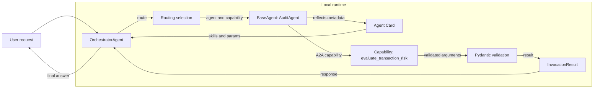
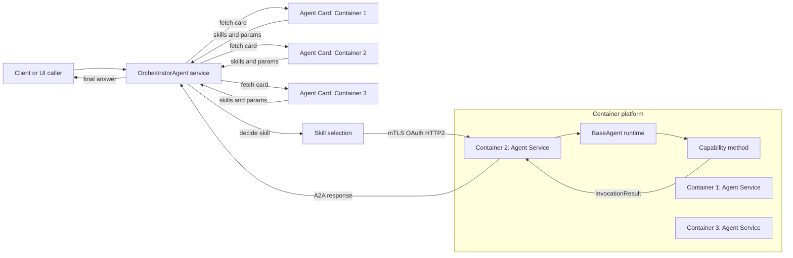
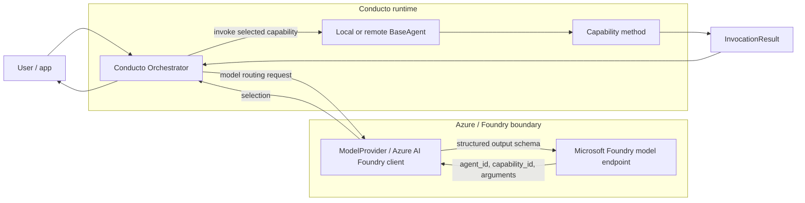
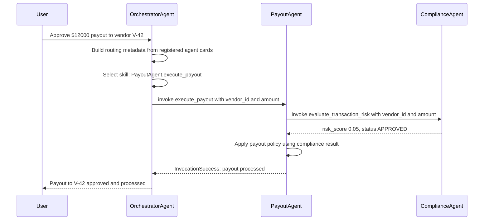
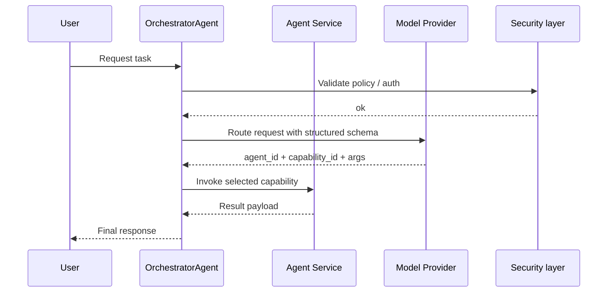

# Communication paths and standards

This document summarizes how the Conducto core architecture communicates across local, containerized, and Microsoft Foundry-backed deployments, and which standards it relies on at each hop.

Deployment location and organizational ownership are independent. Agents can
run in-process, in local or remote containers, or through Microsoft Foundry.
Those agents can all belong to one organization. Cross-organization federation
is an optional trust layer for remotely deployed agents, including agents
hosted in separate Azure organizations or tenants; it is not implied by using
containers or Foundry. See
[Deployment topologies and federation](./deployment-and-federation.md).

Implementation is local-first: prove the agent on one machine, place the same
agent behind A2A transport in local containers, and only then promote it to
Azure. Cloud hosting must preserve the locally verified contracts rather than
introducing a separate agent programming model.

## Standards at a glance

| Layer | Standard or mechanism | Purpose |
|---|---|---|
| Agent discovery | A2A Agent Card | Advertises agent identity, capabilities, and service metadata |
| RPC transport | JSON-RPC 2.0 | Encodes method calls and responses across agent boundaries |
| Network transport | HTTP/2 | High-performance transport for A2A service calls |
| Identity and trust | mTLS 1.3 | Mutual authentication for service-to-service calls |
| Authorization | OAuth 2.0 / OBO | Delegated token exchange across trust boundaries |
| Capability publication | Agent Skill schema | Describes inputs, outputs, and role metadata |
| Tool export | MCP (optional) | Exposes agent capabilities as model-context tools |
| Runtime contracts | Structured JSON schema | Validates arguments and routing decisions |

## 1. Local A2A orchestration path

This is the core, repo-native flow: a local `OrchestratorAgent` selects a local agent capability and invokes it without any external network hop.

### What this path demonstrates

- Reflection drives discovery and service card generation.
- `OrchestratorAgent` uses the published agent metadata rather than hard-coded wiring.
- Invocation is safe, typed, and validated before execution.
- The core repo behavior is centered on deterministic local dispatch.

## 2. Container-based A2A deployment path

Orchestration is not optional in a containerized deployment. The orchestrator is still the component that decides which skill to invoke; it just makes that decision across remote agent services instead of in-process objects. Each container publishes an Agent Card, the orchestrator aggregates those cards into its routing metadata, and only then does it dispatch the call to the container that owns the chosen skill.

### Container path characteristics

- The orchestrator queries every container's `/.well-known/agent-card.json` and builds the same routing metadata it would use locally.
- Skill selection happens once, centrally, before any container receives a request; containers do not need to know about each other to be selectable.
- The network boundary enforces identity and authorization using mTLS and OAuth 2.0 for the single dispatched call.
- The same `BaseAgent` reflection model remains the source of truth for metadata, whether the agent runs in-process or in its own container.

## 3. Microsoft Foundry-based path

This pattern uses an external model provider such as Azure AI Foundry while keeping the same Conducto orchestration model. The model layer participates in routing or execution decisions, but the agent capabilities still reflect locally defined logic and metadata.

### Foundry path characteristics

- The model endpoint is treated as a provider, not as the agent itself.
- Routing is driven by structured-output schemas and `RoutingSelection`.
- Azure identity and secure networking can sit behind the provider layer.
- This allows Conducto to use enterprise-hosted model infrastructure without changing the agent abstraction.

## 4. Example flow: orchestrator picks an agent, then agents talk to each other

Real prompts often need more than one skill. In this example the orchestrator receives a single user prompt, decides which agent should own the request, and that agent in turn calls a second agent over A2A to gather data it does not own itself before returning a combined answer.

Scenario: *"Approve the $12,000 payout to vendor V-42 if the vendor passes compliance review."*

- `OrchestratorAgent` only knows about `PayoutAgent` and `ComplianceAgent` through their Agent Cards; it does not know how they collaborate internally.
- `PayoutAgent` is selected because its `execute_payout` skill matches the prompt.
- `PayoutAgent` calls `ComplianceAgent.evaluate_transaction_risk` directly over A2A before it will execute the payout.

### What this flow demonstrates

- The orchestrator makes exactly one routing decision: which agent and skill best match the prompt. It never talks to `ComplianceAgent` directly.
- `PayoutAgent` treats `ComplianceAgent` as a peer over A2A, using the same capability-invocation contract the orchestrator itself uses, just one hop further out.
- Each hop is independently validated: the orchestrator validates its skill selection, `PayoutAgent` validates the arguments it sends to `ComplianceAgent`, and `ComplianceAgent` validates the arguments it receives.
- This pattern generalizes to containerized and Foundry-based deployments: whichever agent is selected can still call out to other agents over A2A, regardless of whether those agents are in-process, containerized, or remote.

## Cross-cutting communication flow

## Communication standards by hop

### 1. Discovery hop

- `A2A Agent Card` is generated from reflected `@a2a_agent` and `@a2a_capability` metadata.
- The card includes `skills`, `capabilities`, and `x-conducto.parameters` for deeper schema usage.
- This is how a caller learns what an agent can do.

### 2. RPC hop

- Conducto's A2A semantics are represented as JSON-RPC 2.0 requests and responses.
- This allows a provider or peer to invoke methods in a standard, machine-readable way.

### 3. Network hop

- The transport layer uses HTTP/2 for service-to-service calls.
- This allows efficient multiplexing, lower overhead, and compatibility with remote agent endpoints.

### 4. Trust and identity hop

- `mTLS 1.3` proves service identity in both directions.
- `OAuth 2.0 OBO` enables delegated access when a caller acts on behalf of a user or service principal.

### 5. Model integration hop

- `ModelProvider` and `StructuredOutputRequest` define a provider-neutral contract.
- Azure AI Foundry or similar endpoints can implement that contract without redefining the agent runtime.

## Relationship with repo code

The communication model in this repository is encoded in the core implementation:

- `sdk-python/src/conducto/core/decorators.py` declares agent and capability metadata
- `sdk-python/src/conducto/core/agent.py` reflects that metadata into A2A cards and parameter schemas
- `sdk-python/src/conducto/core/orchestrator.py` routes and invokes local capabilities
- `sdk-python/src/conducto/core/provider.py` defines model-provider contracts and structured routing outputs

Together they form the communication backbone for local orchestration, remote service adoption, and enterprise model plumbing.

## Summary

The Conducto communication architecture is intentionally layered:

1. Agents declare capabilities and publish cards.
2. Orchestration selects the correct target.
3. Remote or containerized services expose the same contracts over standard protocols.
4. A model provider can participate in routing without replacing the agent runtime.

That layering keeps the system portable, testable, and ready for both local orchestration and enterprise deployment patterns.
