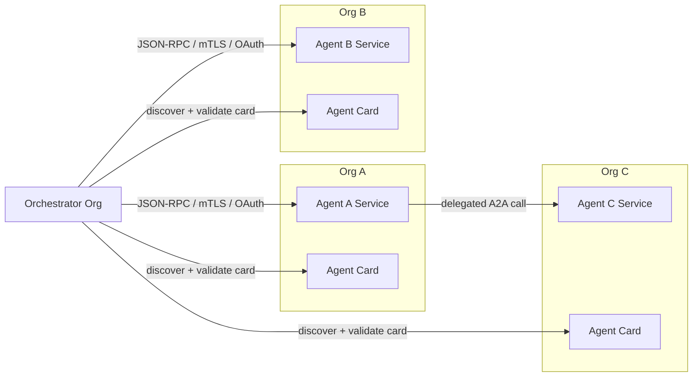
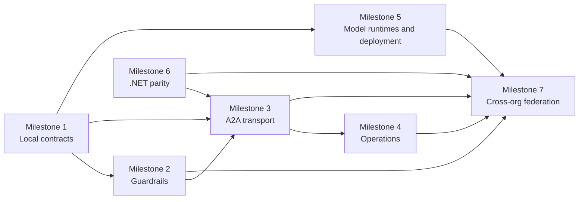

# Cross-organization agent federation

Conducto's cross-organization model is a governed federation of independently
owned agent services. Each organization owns its agent implementation,
deployment, model configuration, credentials, and local authorization policy.
An orchestrator discovers those agents through A2A Agent Cards and invokes
their capabilities through authenticated A2A endpoints.

Cross-organization ownership does not require a special agent type. The same
`BaseAgent`, capability metadata, validation, and typed invocation results used
for local execution form the service contract at the network boundary.

## Target topology

The orchestrator owns discovery, policy-aware routing, and the initial
delegation. A selected agent can call another agent using the same discovery,
authentication, validation, and invocation contracts. Agents do not need to
know about every other participant, share infrastructure, or use the same
model provider.

## Ownership boundaries

| Concern | Agent-owning organization | Orchestrator-owning organization |
|---|---|---|
| Business logic | Owns capability implementation | Does not require implementation access |
| Public contract | Publishes a versioned Agent Card | Validates and indexes the card |
| Deployment | Owns runtime, scaling, and readiness | Owns the orchestrator runtime |
| Authentication | Trusts approved workloads and issuers | Presents workload and delegated identity |
| Authorization | Enforces scopes and approvals locally | Selects only policy-eligible capabilities |
| Models | Chooses providers and deployment defaults | May use a separate model for routing |
| Audit | Records authorization and execution | Records discovery, routing, and invocation |
| Lifecycle | Versions, rotates, or withdraws endpoints | Refreshes, quarantines, or removes registrations |

No organization should publish model credentials, private keys, approval
payloads, or implementation details in an Agent Card. Trust configuration and
secrets remain deployment-owned.

## Federation path

### 1. Define a portable capability contract

Each agent uses `@a2a_agent` and `@a2a_capability` to publish stable identity,
version, descriptions, and JSON Schema parameters. The generated Agent Card is
the contract shared across organizations.

Milestone 1 establishes this reflection, local registration, typed invocation,
model routing, logging, packaging, and per-run model isolation.

### 2. Enforce policy at the capability boundary

Authorization and approval are enforced by the organization that owns the
capability, not only by the caller. An execution context carries the principal,
issuer, scopes, task ID, and correlation ID. Scope checks and signed approval
challenges run before business logic.

Milestone 2 adds transport-independent guardrails, replay-resistant approval
tokens, and security audit events.

### 3. Host and discover remote agents

Each deployment exposes:

- `GET /.well-known/agent-card.json`
- the pinned A2A JSON-RPC 2.0 methods
- health and readiness endpoints
- explicit task, cancellation, input-required, result, and error behavior

An orchestrator registers a validated URL rather than importing the remote
agent. Milestone 3 adds Python and .NET hosting, remote discovery, and
cross-language conformance.

### 4. Establish cross-organization trust

Every connection has two independent checks:

1. mTLS authenticates the calling and receiving workloads.
2. OAuth token exchange propagates the caller or service identity with a
   destination-specific audience and least-privilege scopes.

Federation configuration must define accepted certificate authorities, token
issuers, audiences, scope mappings, key rotation, revocation, and clock-skew
policy. Token acquisition remains separate from transport so organizations can
use RFC 8693 or an explicitly documented provider-specific exchange.

### 5. Register agents in a governed catalog

The orchestrator consumes an allowlisted catalog of Agent Card URLs. Catalog
entries use globally unique, organization-qualified identities such as
`org-a.finance.payout`. Registration records provenance, ownership, supported
contract versions, trust policy, health, and lifecycle state.

Cards are validated before admission and periodically refreshed. Identity or
capability changes are handled according to policy rather than silently
replacing a trusted registration. Withdrawn, expired, unhealthy, or revoked
agents are excluded from routing.

### 6. Route and delegate

The current routing contract selects one `agent_id`, `capability_id`, and
validated argument object. The orchestrator filters candidates through
catalog, trust, compatibility, and authorization policy before model-assisted
selection.

For nested delegation, the selected agent acts as a new A2A caller. It carries
forward only the identity, scopes, task context, and trace context allowed for
the next hop. The receiving agent independently validates and authorizes that
request.

For workflows that require the orchestrator itself to coordinate multiple
agents, the workflow layer records explicit steps, dependencies, retry and
compensation policy, approvals, deadlines, and typed outputs. A model may
propose a plan, but the runtime validates the plan and controls execution.

### 7. Operate and deploy independently

Milestone 4 provides W3C trace propagation, correlated logs, security audit
events, and optional MCP export. Milestone 5 packages immutable container and
Microsoft Foundry deployments with externally supplied model and trust
configuration. Milestone 6 brings .NET to contract parity.

Milestone 7 completes the federation control plane: global identity, signed
discovery metadata, catalog lifecycle, trust onboarding, policy-aware workflow
orchestration, and an end-to-end multi-organization verification.

## Required invariants

- Agent identity is globally unique, stable, attributable to an owning
  organization, and cannot be replaced by changing a discovery URL.
- Every remote Agent Card is schema-valid, provenance-verifiable, versioned,
  and subject to expiration or revocation.
- Every capability invocation is authenticated, authorized, schema-validated,
  correlated, and returned as a typed protocol result.
- Delegation never increases the caller's authority.
- Protected execution cannot occur before required approvals and audit events.
- Routing excludes untrusted, incompatible, revoked, or unhealthy endpoints.
- Model selection and route proposals never bypass deterministic policy.
- Concurrent runs do not mutate shared agent or model configuration.
- Credentials, tokens, signatures, prompts, arguments, and results are
  excluded from discovery metadata and telemetry by default.

## Milestone dependency chain

The practical delivery order is local contracts, guardrails, authenticated
remote transport, operational telemetry and independent deployment, then the
federation control plane and policy-aware workflow runtime.
