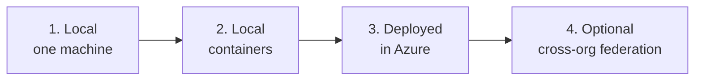
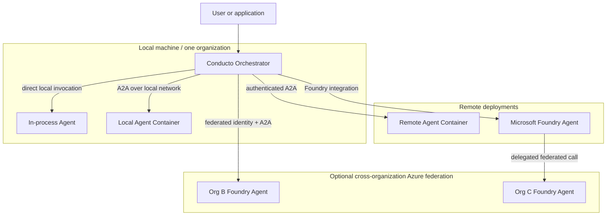
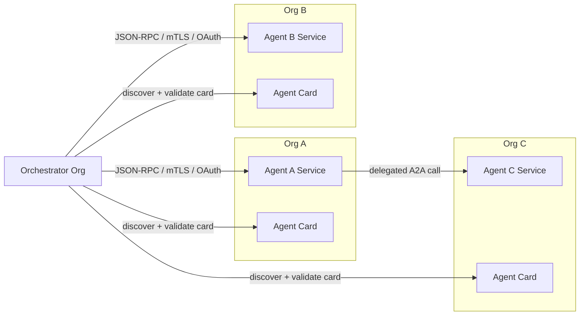

# Deployment topologies and federation

Conducto agents use the same programming and capability model regardless of
where they run. An agent can execute in-process on one machine, in a local or
remote container, or through a Microsoft Foundry-hosted runtime. Those
deployment choices are separate from organizational ownership.

A deployment can contain agents owned by one organization, or remotely
deployed agents can participate across organizations through explicit
federation trust. Deploying an agent to Azure does not by itself make the
deployment cross-organization: one organization can own the orchestrator and
all Azure-hosted agents.

## Local-first promotion path

Conducto follows one ordered implementation and promotion path:

Each stage must preserve the capability contract and behavior proven by the
previous stage:

1. **Local, one machine:** prove agent reflection, Agent Cards, routing,
   validation, guardrails, task state, model selection, and typed results
   without containers, network services, cloud credentials, or Azure.
2. **Local containers:** run the same agent code behind its network boundary,
   prove A2A discovery and transport, and exercise health, readiness,
   cancellation, configuration, and local trust with Docker Compose or an
   equivalent local runtime.
3. **Deployed in Azure:** promote the locally proven images and contracts.
   Add Azure hosting, managed identity, networking, RBAC, secret references,
   telemetry export, scaling, rollout, and rollback without rewriting agent
   business logic.
4. **Cross-organization federation:** after the same-organization Azure path
   works, connect Azure deployments owned by different organizations or
   tenants through explicit federation identity and trust policy.

Cloud services must not be required to complete the one-machine or local
container acceptance paths. Azure integration tests may be opt-in, but their
deterministic contract fixtures must run locally in required CI.

## Two independent dimensions

| Dimension | Supported scenarios |
|---|---|
| Runtime location | Same process, one machine, local containers, remotely deployed containers, Microsoft Foundry |
| Ownership boundary | One organization or multiple federated organizations |

Local execution is normally a single-organization development or
single-machine topology. Cross-organization operation applies when separately
owned remote services establish network reachability and federation trust.
The runtime contract remains the same across every topology.

## Topology overview

The orchestrator and agents may be combined in a hybrid topology. For example,
a local orchestrator can call a local agent, a same-organization container in
Azure, and a federated Foundry agent in another organization during one
workflow.

## Supported scenarios

### 1. One machine

The orchestrator and agents run in the same process or on the same machine.
`OrchestratorAgent` registers `BaseAgent` instances directly and invokes their
capabilities without a network hop. This is the simplest development,
testing, and embedded application model.

### 2. Local containers

The orchestrator and agents run in separate containers on one machine or
development network. Each agent publishes an Agent Card and exposes the A2A
transport, but identity and credentials can come from a deterministic local
development trust configuration.

This topology proves process isolation and network contracts without implying
separate organizational ownership. It is the required promotion gate before
an agent is deployed to Azure.

### 3. Remotely deployed containers

Agents run as independently scalable services in a container platform. They
may all belong to one organization or, where network and trust policy permit,
to different organizations. Runtime images remain model-neutral; provider
endpoints, credentials, certificates, and trust settings are supplied through
deployment configuration.

### 4. Microsoft Foundry in one organization

One organization can deploy the orchestrator and any number of agents through
Microsoft Foundry. Managed identity, private networking, RBAC, model
deployments, telemetry, and lifecycle remain inside that organization's Azure
boundary.

Conducto capabilities map to Foundry tools or actions without duplicating
business logic. The integration preserves Conducto execution context,
guardrails, task state, cancellation, and tracing.

This stage promotes behavior and artifacts already verified on one machine and
in local containers. Azure-specific adapters must not become prerequisites for
the local runtime.

### 5. Microsoft Foundry across organizations

Agents hosted in separate Azure organizations or tenants remain independently
owned and operated. They connect only after federation policy establishes
trusted identities, issuers, audiences, scopes, certificates or workload
credentials, and allowed capabilities.

This is an additional governance and trust layer over the Foundry deployment
model, not a separate agent implementation.

## Cross-organization topology

The orchestrator owns discovery, policy-aware routing, and the initial
delegation. A selected remote agent can call another remote agent using the
same discovery, authentication, validation, and invocation contracts. Agents
do not need to share infrastructure, Azure tenant, source code, credentials,
or model provider.

## Ownership boundaries

| Concern | Agent-owning organization | Orchestrator-owning organization |
|---|---|---|
| Business logic | Owns capability implementation | Does not require implementation access |
| Public contract | Publishes a versioned Agent Card | Validates and indexes the card |
| Deployment | Owns runtime, scaling, and readiness | Owns the orchestrator runtime |
| Authentication | Trusts approved workloads and issuers | Presents workload and delegated identity |
| Authorization | Enforces scopes and approvals locally | Selects only policy-eligible capabilities |
| Models | Chooses providers and deployment defaults | May use a separate model for routing |
| Audit | Records authorization and execution | Records discovery, routing, and invocation |
| Lifecycle | Versions, rotates, or withdraws endpoints | Refreshes, quarantines, or removes registrations |

No organization should publish model credentials, private keys, approval
payloads, or implementation details in an Agent Card. Trust configuration and
secrets remain deployment-owned.

## Common delivery path

### 1. Define a portable capability contract

Each agent uses `@a2a_agent` and `@a2a_capability` to publish stable identity,
version, descriptions, and JSON Schema parameters. The generated Agent Card is
the contract shared across organizations.

Milestone 1 establishes this reflection, local registration, typed invocation,
model routing, logging, packaging, and per-run model isolation.

### 2. Enforce policy at the capability boundary

Authorization and approval are enforced by the organization that owns the
capability, not only by the caller. An execution context carries the principal,
issuer, scopes, task ID, and correlation ID. Scope checks and signed approval
challenges run before business logic.

Milestone 2 adds transport-independent guardrails, replay-resistant approval
tokens, and security audit events.

### 3. Host and discover networked agents

Each deployment exposes:

- `GET /.well-known/agent-card.json`
- the pinned A2A JSON-RPC 2.0 methods
- health and readiness endpoints
- explicit task, cancellation, input-required, result, and error behavior

An orchestrator registers a validated URL rather than importing the networked
agent. The endpoint can be a local container, remote container, or adapter for
a Foundry-hosted agent. Milestone 3 establishes Python agent chaining and the
local gateway; Milestone 4 adds Python A2A network transport. .NET hosting and
cross-language conformance follow in Milestone 8.

### 4. Configure deployment-specific identity and trust

Network calls have two independent checks:

1. mTLS authenticates the calling and receiving workloads.
2. OAuth token exchange propagates the caller or service identity with a
   destination-specific audience and least-privilege scopes.

Within one organization these policies can use a shared organizational trust
domain. Cross-organization federation additionally defines accepted external
certificate authorities, token issuers, audiences, scope mappings, key
rotation, revocation, and clock-skew policy. Token acquisition remains
separate from transport so deployments can use RFC 8693 or an explicitly
documented provider-specific exchange.

### 5. Register remote agents in a governed catalog

The orchestrator consumes an allowlisted catalog of Agent Card URLs for
networked agents. Catalog entries record identity, owner, deployment type,
endpoint, provenance, supported contract versions, trust policy, health, and
lifecycle state. Cross-organization entries use globally unique,
organization-qualified identities such as `org-a.finance.payout`.

Cards are validated before admission and periodically refreshed. Identity or
capability changes are handled according to policy rather than silently
replacing a trusted registration. Withdrawn, expired, unhealthy, or revoked
agents are excluded from routing.

### 6. Route and delegate

The current routing contract selects one `agent_id`, `capability_id`, and
validated argument object. The orchestrator filters candidates through
catalog, trust, compatibility, and authorization policy before model-assisted
selection.

For nested remote delegation, the selected agent acts as a new A2A caller. It
carries forward only the identity, scopes, task context, and trace context
allowed for the next hop. The receiving agent independently validates and
authorizes that request. Local in-process calls use the equivalent typed
execution context without requiring network authentication.

For workflows that require the orchestrator itself to coordinate multiple
agents, the workflow layer records explicit steps, dependencies, retry and
compensation policy, approvals, deadlines, and typed outputs. A model may
propose a plan, but the runtime validates the plan and controls execution.

### 7. Operate and deploy independently

Milestone 5 provides exporters, observability, and packaging, including W3C
trace propagation, correlated logs, and optional MCP export. Security audit
remains part of Milestone 2. Milestone 6 establishes Python model runtimes and
Microsoft Foundry with externally supplied model and trust configuration.

Milestone 7 connects local, container, and Foundry agents through a governed
remote catalog and policy-aware workflow runtime. It applies whether all
agents belong to one organization or a workflow uses a mixture of deployment
types.

Milestone 8 establishes .NET SDK parity and cross-language conformance.
Milestone 9 adds the optional cross-organization federation control plane:
global identity, signed discovery metadata, external trust onboarding, and an
end-to-end multi-organization Azure verification. The local, container, and
single-organization Foundry scenarios do not depend on federation merely to
exist.

## Required invariants

- Agent identity is stable within its deployment scope. Federated identities
  are globally unique, attributable to an owning organization, and cannot be
  replaced by changing a discovery URL.
- Every remote Agent Card is schema-valid and versioned. Federated cards are
  also provenance-verifiable and subject to expiration or revocation.
- Every capability invocation is authorized, schema-validated, correlated,
  and returned as a typed protocol result. Network invocations are also
  authenticated.
- Delegation never increases the caller's authority.
- Protected execution cannot occur before required approvals and audit events.
- Routing excludes untrusted, incompatible, revoked, or unhealthy endpoints.
- Model selection and route proposals never bypass deterministic policy.
- Concurrent runs do not mutate shared agent or model configuration.
- Credentials, tokens, signatures, prompts, arguments, and results are
  excluded from discovery metadata and telemetry by default.

## Milestone dependency chain

```mermaid
flowchart LR
    M1[1. Python local agent flow] --> M2[2. Python security and governance]
    M2 --> M3[3. Python agent chaining and local gateway]
    M3 --> M4[4. Python A2A network transport]
    M4 --> M5[5. Python exporters, observability, and packaging]
    M5 --> M6[6. Python model runtimes and Microsoft Foundry]
    M6 --> M7[7. Python hybrid deployment and workflow orchestration]
    M7 --> M8[8. .NET SDK parity and cross-language conformance]
    M8 --> M9[9. Cross-organization federation]
```

The practical delivery order is strict: one-machine contracts and execution,
local containers and A2A transport, same-organization Azure deployment, hybrid
orchestration, .NET parity and cross-language conformance, then optional
cross-organization federation. This is the canonical milestone order, not a
claim that every story in an earlier milestone is already complete.
