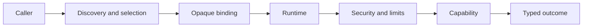
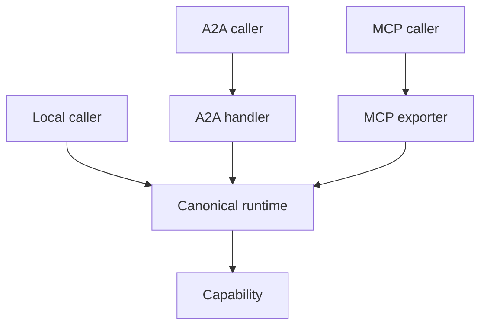

# Architecture overview

## Start with the request

Every Conducto request follows the same broad path:

The caller may be ordinary application code, an orchestrator, an A2A network
adapter, or an MCP tool adapter. The runtime remains the execution authority.

## Five architectural layers

### 1. Declaration

Agents declare identity and typed capabilities. They do not own global
registries, network clients, credentials, or provider infrastructure.

### 2. Discovery

Registries describe local instances. Catalogs describe admitted remote
deployments. A gateway applies policy, selects a target, and returns an opaque
binding.

### 3. Execution

The runtime validates arguments and bindings, establishes immutable run
context, applies security and approvals, resolves models, enforces deadlines
and cancellation, invokes the capability, and creates a typed result.

### 4. Adapters

Provider adapters talk to model services. A2A and MCP adapters project the
canonical Conducto contract onto network protocols. Adapters do not create
alternate validation or security paths.

### 5. Operation

Applications own processes, listeners, credentials, TLS, reverse proxies,
production persistence, and deployment configuration.

## Local is the reference behavior

Network and hosted execution are adapters around local runtime semantics:

If remote behavior differs from local validation, authorization, cancellation,
or result mapping, the adapter is wrong.

## State ownership

| State | Owner |
|---|---|
| Reflected capability metadata | Agent instance |
| Local agent lifecycle | `AgentRegistry` |
| Remote deployment lifecycle | `AgentCatalog` |
| Provider bindings and lifecycle | `ProviderRegistry` / `Runtime` |
| Invocation context | `Runtime` |
| A2A tasks | Injected `TaskRepository` |
| Credentials and listeners | Application |

For a more exhaustive component graph, see the existing
[architecture reference](../architecture.md).
