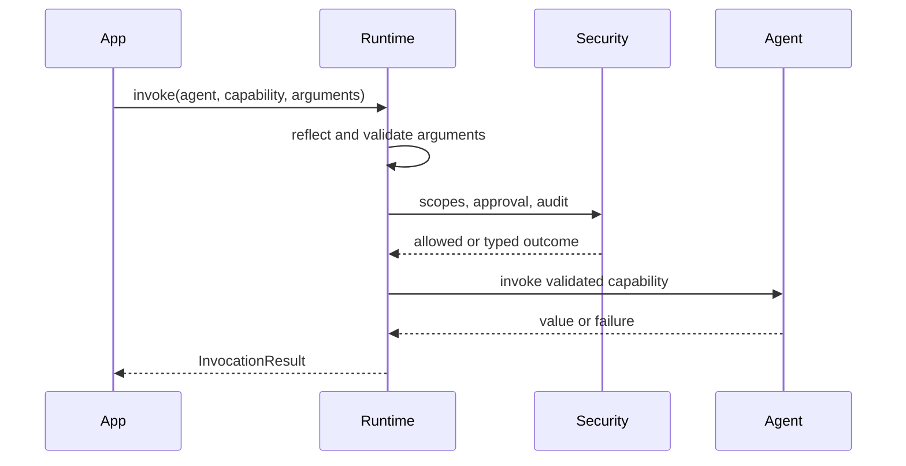
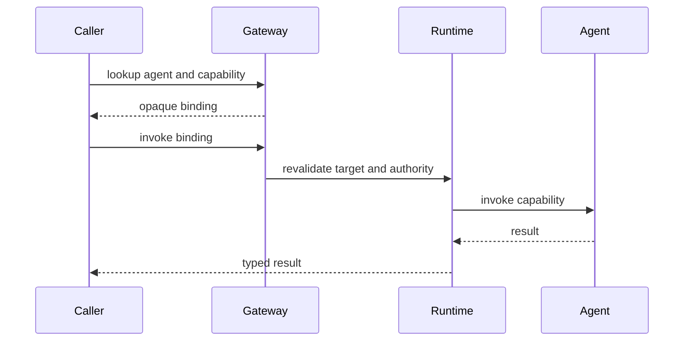
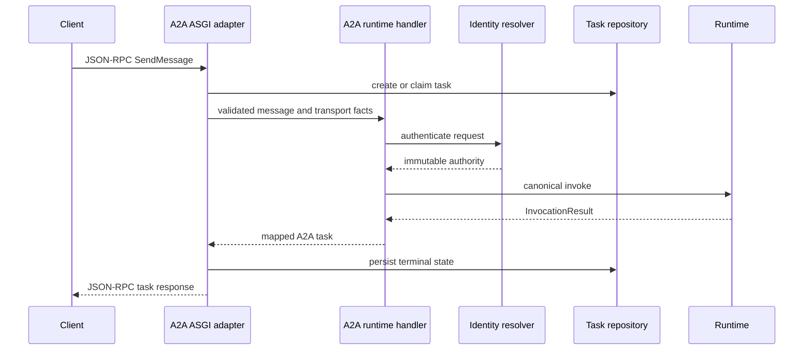

# Invocation lifecycle

## Plain-language flow

A request does not jump directly to an agent method. Conducto turns it into a
validated, authorized, bounded invocation.

```text
find target
  → bind exact capability
  → validate request
  → check identity and policy
  → establish limits
  → execute
  → serialize a typed outcome
```

## Local invocation



## Gateway invocation

The gateway adds selection and an opaque binding:



The binding prevents model-facing or remote callers from holding mutable agent
objects or arbitrary callables.

## Inbound A2A invocation



Raw credentials stop at the identity resolver. The runtime receives identity
facts, not tokens.

## Deadline and cancellation behavior

Deadlines can only become shorter through nested calls. Cancellation uses a
shared cooperative state so the runtime, provider, gateway, and capability can
observe the same request to stop.

Different events remain distinct:

- caller coroutine cancellation;
- explicit application cancellation;
- runtime timeout;
- remote A2A task cancellation; and
- later operational drain/shutdown.

Adapters must map these events explicitly rather than hiding them as generic
failures.

## Result behavior

The runtime always returns an `InvocationResult` subtype. Protocol adapters
map these typed results into safe protocol outcomes. Raw exceptions never
become public wire messages.

See [runtime and invocation](../runtime-and-invocation.md) and
[A2A server](../a2a-server.md) for exact behavior.
