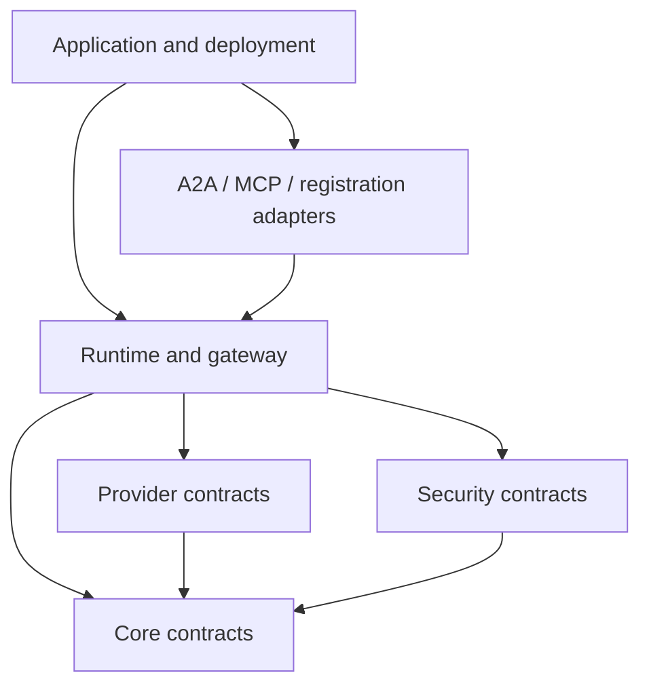

# Module map

Use this map to find the owner of a behavior before changing code.

| Package or module | Owns | Must not own | Main extension points |
|---|---|---|---|
| `conducto.core.agent` | Agent reflection, capability metadata, Agent Card generation | Global registration, credentials, provider clients | Agent and capability decorators |
| `conducto.core.registry` | Local identity, lifecycle, immutable snapshots | Remote calls, models, authorization decisions | `AgentRegistry` |
| `conducto.core.catalog` | Admitted remote deployments and lifecycle | Capability execution, model calls | Catalog providers and records |
| `conducto.core.gateway` | Policy-filtered discovery, selection, opaque bindings | Direct model calls, mutable agent exposure | Selection and remote transport policies |
| `conducto.core.runtime` and invocation modules | Context, binding revalidation, security, model resolution, deadlines, cancellation, results | HTTP parsing, credentials, global discovery | Runtime configuration and policy hooks |
| `conducto.core.delegation` | Bounded model/tool loop and fallback | Registries, credentials, transport endpoints | Toolbox and delegation policies |
| `conducto.security` | Identity facts, scopes, approvals, tokens, audit contracts | Credential storage, listeners, provider clients | Validators, stores, emitters, policy decorators |
| `conducto.providers` | Model-service adapters and capability normalization | Agent discovery, global defaults, runtime policy | Provider protocol implementations |
| `conducto.transport` | Remote A2A discovery/client, auth transport helpers, TLS, task protocol | Local registry, capability methods | Client transports and task repositories |
| `conducto.a2a` | A2A profile projection, ASGI host, runtime bridge, result mapping | Direct capability execution, server process ownership | Identity resolver, task repository, low-level handler |
| `conducto.mcp` | Policy-filtered MCP projection and server adapters | A second reflection or invocation path | Export policy and identity resolver |
| `conducto.registration` | Authenticated deployment admission and leases | Capability invocation | Registration grants, service, client, ASGI adapter |
| `conducto.resources` | Deployment-owned data source provisioning, ingestion, indexing state, readiness policy and retirement | Agent-owned reading, backend SDKs, credentials, background polling | Provisioner, ingestor, readiness probe, lifecycle backends |
| `conducto.testing` | Deterministic public test helpers | Production defaults or hidden test behavior | Fake providers and conformance fixtures |

## Dependency direction

Higher layers compose lower layers. Core contracts must not import deployment
frameworks.

## Before adding a module

Ask:

1. Which existing layer owns this responsibility?
2. Is this a contract, a reference implementation, or an adapter?
3. Does it create a second path for validation, security, or serialization?
4. Who creates, closes, and replaces its resources?
5. Can local tests exercise it without cloud services?

If the ownership is unclear, update this map and record the decision before
adding code.
