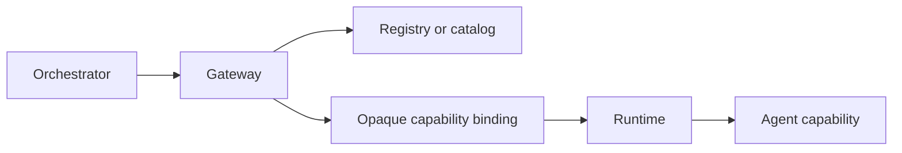

# Agents, capabilities, and orchestrators

## In plain English

An **agent** is a worker with a clear responsibility.

A **capability** is one named thing that worker can do.

An **orchestrator** is a coordinator. It decides which worker should handle a
request and passes the work to it.

For the travel example:

| Role | Example |
|---|---|
| Agent | Weather agent |
| Capability | Get the temperature for a city |
| Orchestrator | Travel assistant |
| Result | `{"city": "Toronto", "celsius": 21}` |

## Why capabilities are explicit

An agent might have many ordinary Python methods. Conducto exposes only methods
declared as capabilities. This provides a small, typed, reviewable public
surface instead of making the whole object callable.

```python
from conducto import BaseAgent, a2a_agent, a2a_capability


@a2a_agent(
    name="WeatherAgent",
    version="1.0.0",
    description="Provides local weather.",
)
class WeatherAgent(BaseAgent):
    @a2a_capability(
        name="temperature",
        description="Returns the temperature for one city.",
    )
    def temperature(self, city: str) -> dict[str, object]:
        return {"city": city, "celsius": 21}
```

The type annotation on `city` becomes part of the input schema. The returned
value is normalized before it leaves the runtime.

## The supporting roles

As systems grow, four other roles matter:

- A **registry** remembers local agent instances.
- A **catalog** remembers admitted remote deployments.
- A **gateway** finds an eligible capability and creates an opaque binding.
- The **runtime** validates and executes the binding under policy.



The orchestrator coordinates. It does not own global registration, credentials,
or transport details.

## Under the hood

| Idea | Main public API |
|---|---|
| Agent | `BaseAgent`, `@a2a_agent` |
| Capability | `@a2a_capability` |
| Local registration | `AgentRegistry` |
| Coordination | `OrchestratorAgent` |
| Governed execution | `Runtime` |
| Selection | `AgentGateway` through a runtime context |

For exact contracts, see [agents and registration](../agents-and-registration.md)
and [orchestration and delegation](../orchestration-and-delegation.md).

Next: [how agents communicate](./how-agents-communicate.md).
