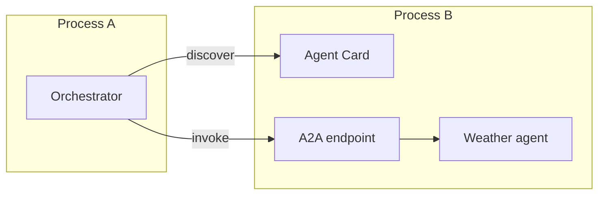

# How agents communicate

## Two ways to call an agent

When two agents live in the same Python process, Conducto can call the target
directly through the runtime. No HTTP server is needed.

When they live in different processes, the remote agent publishes:

- an **Agent Card** describing its identity and capabilities; and
- an **A2A endpoint** that accepts structured requests.

## Discovery is not permission

Reading an Agent Card means, “this deployment says it can perform these
capabilities.” It does not mean, “the caller may use every capability.”

Conducto treats these as separate decisions:

1. **Discovery:** what exists?
2. **Binding:** which exact target was selected?
3. **Authorization:** may this caller use it?
4. **Invocation:** run it through the governed runtime.

## Local and remote calls share one execution path

The network adapter does not call the Python method directly. It converts the
request into the same runtime invocation used locally.

This is why moving an agent to another process should not change its business
logic.

## Technical terms

| Term | Meaning |
|---|---|
| Agent Card | Public description of an agent and its capabilities |
| A2A | The Agent2Agent protocol used for remote messages and tasks |
| ASGI | Python interface between Conducto's HTTP app and a server such as Uvicorn |
| Task | A2A record of accepted work and its state |
| Binding | Opaque proof of the exact selected capability target |

## Implementation map

- Agent Card creation: `BaseAgent.get_agent_card()`
- Safe card retrieval: `conducto.transport.discover_agent()`
- Remote client: `conducto.transport.A2AClient`
- Recommended inbound app: `conducto.a2a.create_a2a_app()`
- Low-level inbound adapter: `conducto.a2a.A2AASGI`
- Runtime bridge: `conducto.a2a.A2ARuntimeHandler`

See [the A2A server guide](../a2a-server.md) for protocol details.

Next: [security in plain English](./security-in-plain-english.md).
