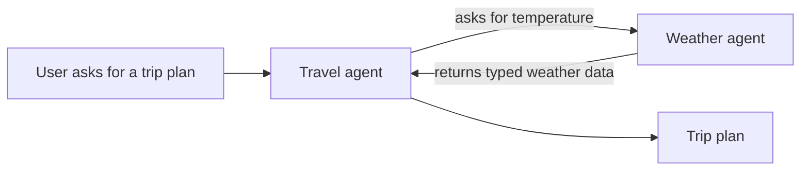

# What Conducto is

## The short version

Conducto helps several specialized AI agents work together without giving
every agent unrestricted access to every action.

An application can use Conducto to:

- describe what each agent can do;
- find an agent with the needed ability;
- check whether the caller is allowed to use that ability;
- run the work with time, cancellation, and delegation limits; and
- return a predictable success or failure result.

## A simple example

Imagine a travel assistant. It knows how to build an itinerary, but it does
not know the current weather. A separate weather agent owns that ability.

Conducto sits around these calls. It makes sure the travel agent can only call
an allowed weather capability, validates the city argument, carries deadlines
and cancellation, and returns a typed result.

## What Conducto is not

Conducto is not:

- a chat user interface;
- a model server;
- a model downloader;
- a replacement for Ollama, OpenAI, or Microsoft Foundry;
- a web server or process supervisor; or
- a place to store credentials inside an agent.

It is the coordination and governance layer between application code, agents,
models, and transports.

## What stays the same

The same agent capability can run:

- in the caller's Python process;
- in another local process;
- in a container; or
- behind a hosted deployment.

The deployment changes. The capability contract and governed execution path do
not.

## The first technical connection

Conducto calls an agent's named ability a **capability**. Python classes declare
agents with `@a2a_agent` and capabilities with `@a2a_capability`.

Do not worry about the decorators yet. The next page explains the roles first:
[agents, capabilities, and orchestrators](./agents-capabilities-orchestrators.md).
