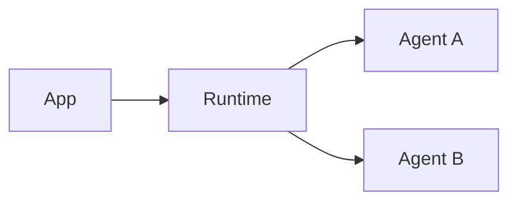
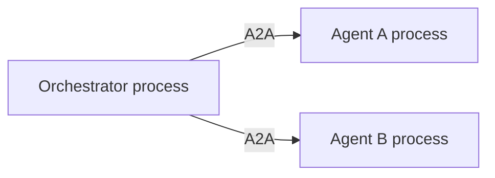

# Where agents can run

## Start with the simplest topology

Begin with all agents in one Python process. It is faster to develop, easier to
debug, and proves the capability contract without networking.



## Move to separate processes when needed

Use separate processes when agents need independent deployment, dependencies,
scaling, ownership, or failure isolation.



Each hosted agent uses Conducto's ASGI application. An application-owned server
such as Uvicorn opens the network listener.

## Containers change packaging, not semantics

A container packages the same installed Python agent, runtime, configuration,
and A2A app. Conducto does not require agent business logic to know whether it
runs locally or in a container.

## Hosted deployments

Later deployment adapters can host the same contracts in Microsoft Foundry.
Cloud identity, networking, secrets, and process operation remain deployment
concerns; they do not belong in the agent class.

## What the application owns

Conducto owns capability and invocation semantics. The application or platform
owns:

- process launch and supervision;
- bind addresses and ports;
- TLS termination and reverse proxies;
- credentials and secret retrieval;
- production persistence; and
- deployment health policy.

## Promotion path

```text
one process
  → separate local processes
  → local containers
  → hosted deployment
  → hybrid workflows
```

Prove each step before moving to the next. See
[deployment topologies](../deployment-and-federation.md) for the detailed
model.

Next: [create one local agent](../using/first-local-agent.md).
